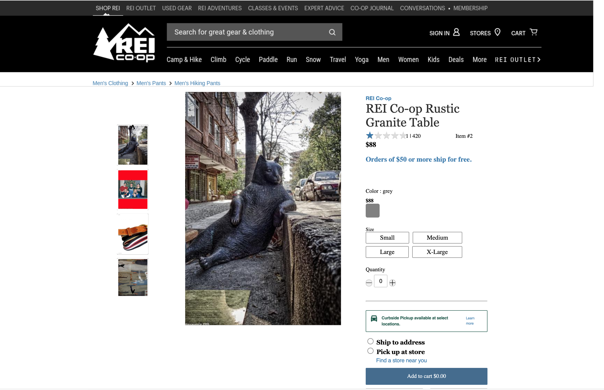
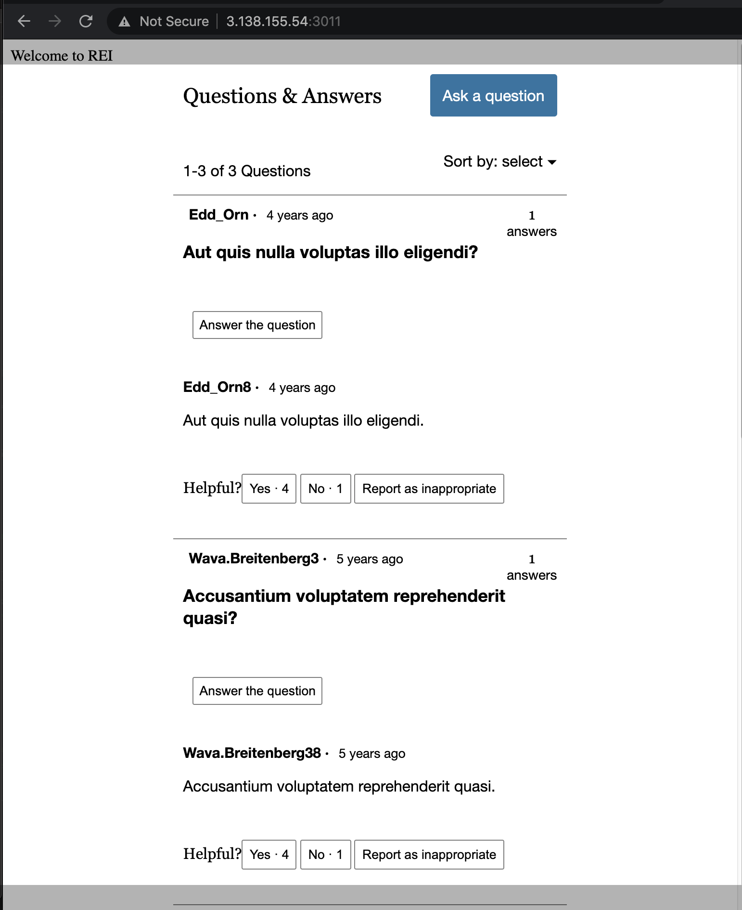
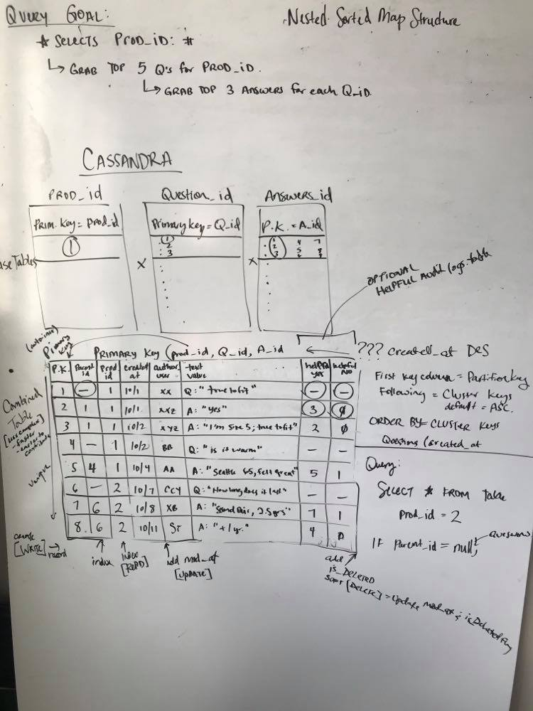
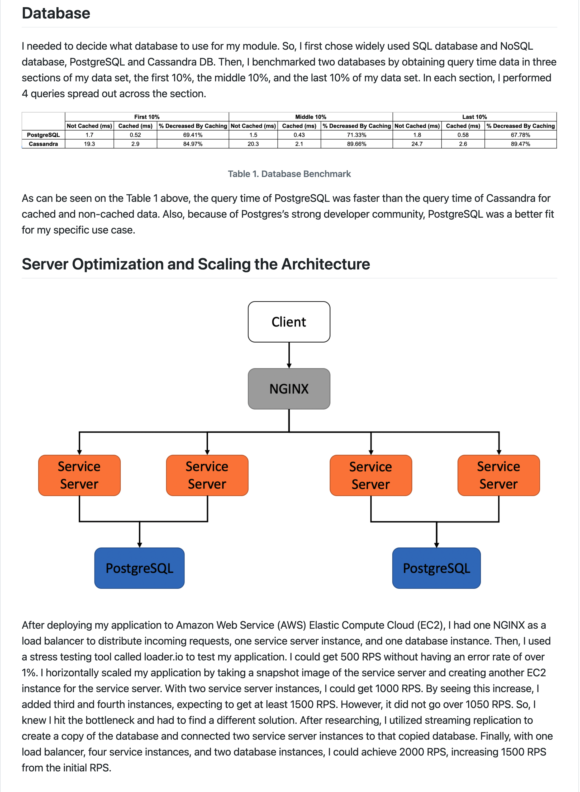
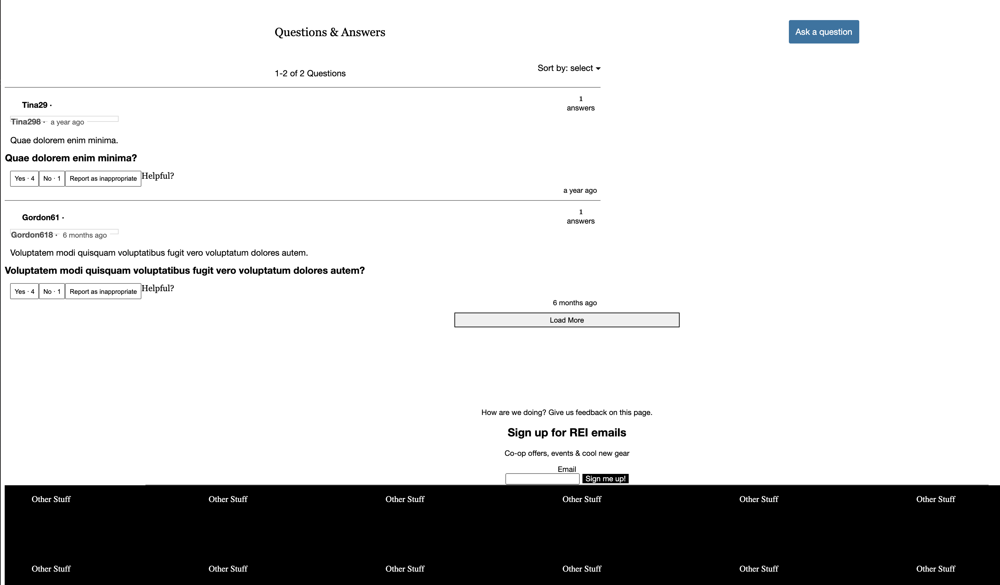
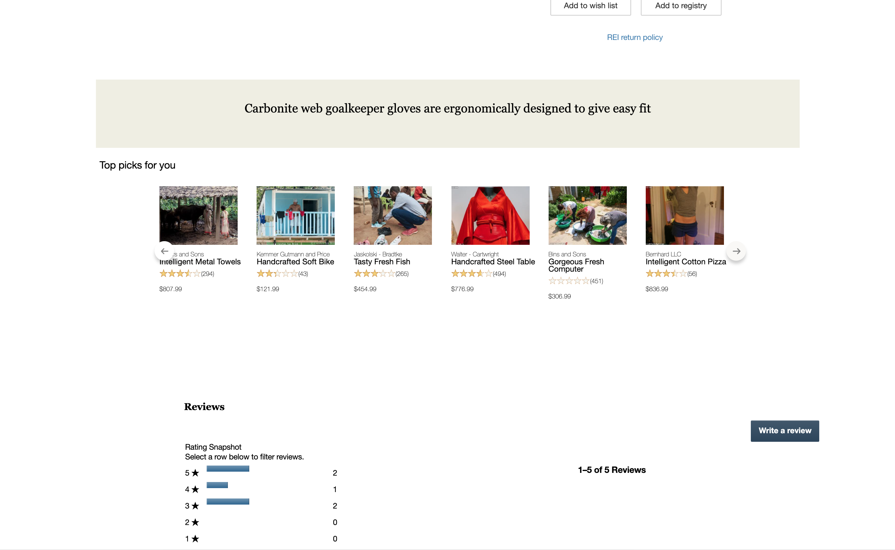

# Built by Jacki
I love coding, spreading positivity and hearing feedback! Let's connect.

<!-- LinkedIn -->

<!-- Github -->

<!-- Email -->

## Back End Database Migration

Redesigned legacy backend to handle scaled client requests for retail eCommerce site.

1. Replaced legacy backend with a new backend powered by Cassandra database to improve benchmarked CRUD performance by 40% for production level traffic
2. Deployed database, services, load balancer and proxy on Amazon Elastic Compute Cloud (EC2) instances
3. Increased successful user requests by 200% after stress testing the deployed application using LoaderIO/K6
4. Identified bottlenecks within backend architecture utilizing NewRelic to efficiently test production level traffic
5. Increased fault tolerance and system availability for users by horizontally scaling proxy and service layers with NGINX load balancers to handle production level surges

## Documentation
1. [Project ReadMe](#Back-End-Database-Migration)
1. [Getting Started](#Getting-Started)
1. [Design](#Whiteboarding-Database)
1. [Related Projects](#Related-Projects)
1. [Technologies](#Technologies)

## Getting Started

Clone the Github repository:
* `$ git clone https://github.com/The-10-000-RPS-Club/service-jacki.git`

Navigate inside of the directory `./questions-service` and run the following commands:
1. `$ npm install`
2. `$ npm run build`
3. `$ npm start`

Open a new browser tab to see the app:
* `http://localhost:3001`

## Whiteboarding Database

### Front-End Challenges
1) Protect user experience in UI while migrating backend database.
2) Reduce structural changes via server retrieval and front end data.

### Back-End Challenges
1) Choose database for service by benchmarking the CRUD speeds most utilized
2) Deploy application with load balancer (NGINX)
3) Resolve bottlenecks found with stress testing via Loader.io / K6

## Related Projects
  - [GoOutdoor Q&A Service Migration](https://github.com/The-10-000-RPS-Club/relatedItems-chris)
  - [Reviews Service](https://github.com/The-Emerald-Kraken/review-service)
  - [Relate Items Service](https://github.com/The-Emerald-Kraken/relatedItems-service)

## Technologies
* React
* Node.js
* Express
* Cassandra
* Webpack
* Docker
* AWS EC2 (currently not live)